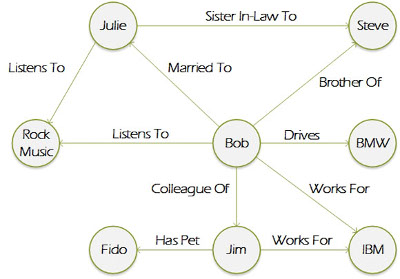

# Lecture 10

### Databases

**Database** - systematized storage for information.

- Hierarchical


- Network


- Relational


- Object oriented


- Graph



- Document


### ACID

- Atomicity
- Consistency
- Isolation
- Durability

### SQL

###### Syntax

- **SELECT** - extracts data from a database
- **UPDATE** - updates data in a database
- **DELETE** - deletes data from a database
- **INSERT** INTO - inserts new data into a database
- **CREATE DATABASE** - creates a new database
- **ALTER DATABASE** - modifies a database
- **DROP DATABASE** - deletes a database
- **CREATE TABLE** - creates a new table
- **ALTER TABLE** - modifies a table
- **DROP TABLE** - deletes a table

```sql
--Select all users;
SELECT * FROM Users;
```

###### WHERE

- **=** -  Equal
- **<>** -  or != Not equal
- **>** -  Greater than
- **<** -  Less than
- **>=** -  Greater than or equal
- **<=** -  Less than or equal
- **BETWEEN** -  Between an inclusive range
- **LIKE** -  Search for a pattern
- **IN** -  To specify multiple possible values for a column

**Wildcard characters**:
- **%** - zero or more characters
- **_** - single character
- **[list]** - list of characters to match
- **[^list]** or **[!list]** - list of characters to not match

###### Operators

**Logical:**
- AND
- OR
- NOT

**Comparison:**
- **<**
- **>**
- **<=**
- **>=**
- **=**
- **<> or !=**

**Math:**
- **+**
- **-**
- **\***
- **/**
- **%**
- **^**
- **|/**
- **@**
- **...**


###### Functions

```sql
SELECT AVG(Price) from Products
```

###### Aliases

```sql
-- column
SELECT column_name AS alias_name FROM table_name;
SELECT CustomerID as ID, CustomerName AS Customer FROM Customers;
-- table
SELECT column_name(s) FROM table_name AS alias_name;
```

###### JOIN

- INNER


- LEFT


- RIGHT


- FULL


