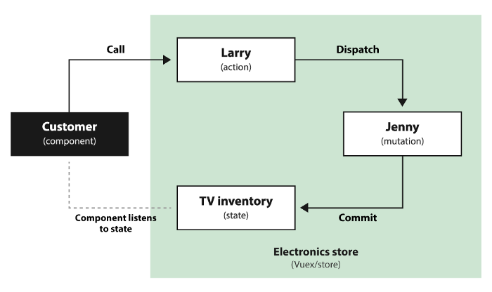

# Lecture 14

### Vuex
>Flux libraries are like glasses: you’ll know when you need them.

- https://vuejs.org/v2/guide/state-management.html#Simple-State-Management-from-Scratch

- https://vuex.vuejs.org/

- https://medium.com/@KucherDev/vuex-%D1%8D%D1%82%D0%BE-%D0%BF%D1%80%D0%BE%D1%81%D1%82%D0%BE-6807d9ad330d

- reactivity
- history control
- easy access from any part of app

### Auth
- https://github.com/alexburykin/vue-demo

### Slots
- https://vuejs.org/v2/guide/components-slots.html#ad

### Custom directives
- https://github.com/Alex-Sokolov/vue-course-app/blob/03-vue-cli-plugins/src/components/datepicker.vue

### Forms
- Vee-validate

