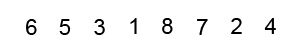

# Lecture 8

### Introduction

Object Oriented Programming (OOP) and Functionnal Programming (FP) are programming paradigms. Roughly speaking, following a programming paradigm is writing code compliant with a specific set of rules. For example, organizing the code into units would be called OOP, avoiding side effects would be called FP.

**OOP Pros:**

- Objects and methods are very readable and understandable.

- OOP utilizes an imperative style, in which code reads like a straight-forward set of instructions as a computer would read it.

**OOP Cons:**

- OOP commonly depends upon shareable state. The unfortunate result of so many objects and methods existing within the same state and being accessed in an entirely undetermined order can lead the pre-discussed concept of “race conditions”.

**FP Pros:**

- Utilizing pure functions, leads to reliable functions with no side effects that accomplish and return exactly what you expect them to.

- FP utilizes a more declarative style, which focuses more on what to do and less about how it’s being done. This places the emphasis on performance and optimization, leaving the door to refactor without completely reworking your code.

**FP Cons:**

- Functional programming is a newer paradigm. It’s much easier to find documentation and information on the OOP approach.

- Similar to one of OOP’s strengths, functional programming can lack readability at times. Sometimes functions can become very verbose and become difficult to follow comparatively to the object-oriented style.

You saw a simple example of this in the Person object and createPerson function we discussed earlier.

### Interfaces

```js
function CoffeeMachine(power) {
  this.waterAmount = 0; 

  alert( 'Coffee machine with power: ' + power + ' watt created');
}

// create
var coffeeMachine = new CoffeeMachine(100);

// add water
coffeeMachine.waterAmount = 200;
```

###### Private and Public methods
```js
function CoffeeMachine(power) {

  this.waterAmount = 0;

  // private method
  function getBoilTime() {
    return 1000;
  }

  // private method
  function onReady() {
    alert( 'Кофе готов!' );
  }

  // public method
  this.run = function() {
    setTimeout(onReady, getBoilTime());
  };
}


var coffeeMachine = new CoffeeMachine(100);
coffeeMachine.waterAmount = 200;

coffeeMachine.run();
```

###### Access to object from internal methods
```js
function CoffeeMachine(power) {
  this.waterAmount = 0;
  var WATER_HEAT_CAPACITY = 4200;

  function getBoilTime() {
    return this.waterAmount * WATER_HEAT_CAPACITY * 80 / power;
  }

  function onReady() {
    alert( 'Coffee ready!' );
  }

  this.run = function() {
    // usding call
    setTimeout(onReady, getBoilTime.call(this));
  };
}
var coffeeMachine = new CoffeeMachine(100000);
coffeeMachine.waterAmount = 200;
coffeeMachine.run();
``` 

or

```js
function CoffeeMachine(power) {
  this.waterAmount = 0;

  var WATER_HEAT_CAPACITY = 4200;

  var getBoilTime = function() {
    return this.waterAmount * WATER_HEAT_CAPACITY * 80 / power;
  }.bind(this);

  function onReady() {
    alert( 'Coffee ready!' );
  }

  this.run = function() {
    setTimeout(onReady, getBoilTime());
  };
}
var coffeeMachine = new CoffeeMachine(100000);
coffeeMachine.waterAmount = 200;
coffeeMachine.run();
```

###### Using `this` as closure
```js
function CoffeeMachine(power) {
  this.waterAmount = 0;

  var WATER_HEAT_CAPACITY = 4200;

  // this as closure
  var self = this;

  function getBoilTime() {
      return self.waterAmount * WATER_HEAT_CAPACITY * 80 / power;
    }

  function onReady() {
    alert( 'Coffee ready!' );
  }

  this.run = function() {
    setTimeout(onReady, getBoilTime());
  };

}

var coffeeMachine = new CoffeeMachine(100000);
coffeeMachine.waterAmount = 200;
coffeeMachine.run();
```
self now needs correct getters and setters to work correctly ;)


### Functional OOP

```js
function Machine() {
  var enabled = false;

  this.enable = function() {
    enabled = true;
  };

  this.disable = function() {
    enabled = false;
  };
}
```

```js
function CoffeeMachine(power) {
  Machine.call(this); // отнаследовать

  var waterAmount = 0;

  this.setWaterAmount = function(amount) {
    waterAmount = amount;
  };

}

var coffeeMachine = new CoffeeMachine(10000);

coffeeMachine.enable();
coffeeMachine.setWaterAmount(100);
coffeeMachine.disable();
```


```js
showFullName.call(user, 'firstName', 'surname'); // arguments listed
showFullName.apply(user, ['firstName', 'surname']); // arguments as array
```

access to parents properties
```js
function Machine() {
  var enabled = false;

  this.enable = function() {
    enabled = true;
  };

  this.disable = function() {
    enabled = false;
  };
}

function CoffeeMachine(power) {
  Machine.call(this);

  this.enable();

  alert( enabled ); // ERROR!
}

var coffeeMachine = new CoffeeMachine(10000);
```


```js
function Machine() {
  this._enabled = false; // -> var enabled

  this.enable = function() {
    this._enabled = true;
  };

  this.disable = function() {
    this._enabled = false;
  };
}

function CoffeeMachine(power) {
  Machine.call(this);

  this.enable();

  alert( this._enabled ); // -> true
}

var coffeeMachine = new CoffeeMachine(10000);
```

if we want to extend some inherited property

```js
function CoffeeMachine(params) {
  Machine.apply(this, arguments);

  var parentProtected = this._protectedProperty;
  this._protectedProperty = function(args) {
    parentProtected.apply(this, args); // (*)
    // ...
  };
}
```

### Prototype OOP

###### Property proto
*except IE10 -* 
```js
var animal = {
  eats: true
};
var rabbit = {
  jumps: true
};

rabbit.__proto__ = animal;

alert( rabbit.jumps ); // true
alert( rabbit.eats ); // true
```

###### Method hasOwnProperty
```js
var animal = {
  eats: true
};

var rabbit = {
  jumps: true,
  __proto__: animal
};

for (var key in rabbit) {
  alert( key + " = " + rabbit[key] ); // `eats` and `jumps`
}
```
with `hasOwnProperty` check
```js
alert( rabbit.hasOwnProperty('jumps') ); // true
alert( rabbit.hasOwnProperty('eats') ); // false
```
check only own object 
```js
var animal = {
  eats: true
};

var rabbit = {
  jumps: true,
  __proto__: animal
};

for (var key in rabbit) {
  if (!rabbit.hasOwnProperty(key)) continue; // пропустить "не свои" свойства
  alert( key + " = " + rabbit[key] ); // выводит только "jumps"
}
```

###### `.prototype` method
```js
var animal = {
  eats: true
};

function Rabbit(name) {
  this.name = name;
  this.__proto__ = animal;
}

var rabbit = new Rabbit("Кроль");

alert( rabbit.eats ); //true from prototype
```

crossbrowser solution
```js
var animal = {
  eats: true
};

function Rabbit(name) {
  this.name = name;
}

Rabbit.prototype = animal;

var rabbit = new Rabbit("Кроль"); //  rabbit.__proto__ == animal

alert( rabbit.eats ); // true
```

###### `instanceof`
```js
function Rabbit() {}

var rabbit = new Rabbit();

alert( rabbit instanceof Rabbit ); // true
```

###### Inheritance
```js
function Animal(name) {
  this.name = name;
  this.speed = 0;
}

Animal.prototype.stop = function() {
  this.speed = 0;
  alert( this.name + ' stay' );
}

Animal.prototype.run = function(speed) {
  this.speed += speed;
  alert( this.name + ' runs, speed ' + this.speed );
};

function Rabbit(name) {
  this.name = name;
  this.speed = 0;
}

Rabbit.prototype = Object.create(Animal.prototype);
Rabbit.prototype.constructor = Rabbit;

Rabbit.prototype.jump = function() {
  this.speed++;
  alert( this.name + ' jumps, speed ' + this.speed );
}
```

### Algorithms

###### Complexity - O

- O(log(n))
- O(n)
- O(n*log(n)), 
- O(n^2)
- O(n!)
- O(√n)

###### Linear search


> Complexity O(n)

```js
function linearSearch(arr, itemToSearch) {
  for (let i = 0; i < arr.length; i++) { 
    if (arr[i] === itemToSearch) {
      return i;
    }
  }
  return -1;
}

let arr = ['a', 'b', 'c', 'd', 'e'];
console.log(linearSearch(arr, 'd'));
```

###### Binary search


> Complexity O(log(n))

```js
function compare(item1, item2) {
  if (item1 === item2) {
    return 0;
  }
  return item1 < item2 ? -1 : 1;
}

function binarySearch(sortedArr, itemToSearch) {
  let startIndex = 0;
  let endIndex = sortedArr.length - 1;

  while (startIndex <= endIndex) {
    const middleIndex = startIndex + Math.floor((endIndex - startIndex) / 2);
    if (sortedArr[middleIndex] === itemToSearch) {
      return middleIndex;
    }
    if (compare(sortedArr[middleIndex], itemToSearch) < 0) {
      startIndex = middleIndex + 1;
    } else {
      endIndex = middleIndex - 1;
    }
  }
  return -1;
}

let arr = ['a', 'b', 'c', 'd', 'e'];
console.log(binarySearch(arr, 'd'));
```

###### Block(jump) search

> Complexity O(√n)

```js
function compare(item1, item2) {
  if (item1 === item2) {
    return 0;
  }
  return item1 < item2 ? -1 : 1;
}

function jumpSearch(sortedArr, itemToSearch) {
  let jumpSize = Math.floor(Math.sqrt(sortedArr.length));
  let blockStart = 0;
  let blockEnd = jumpSize;
  while(compare(itemToSearch, sortedArr[Math.min(blockEnd, sortedArr.length) - 1]) > 0 ) {
    blockStart = blockEnd;
    blockEnd += jumpSize;
    if (blockStart > sortedArr.length) {
      return -1;
    }
  }
  let currentIndex = blockStart;
  while(currentIndex < Math.min(blockEnd, sortedArr.length)) {
    if (compare(sortedArr[currentIndex], itemToSearch) === 0) {
      return currentIndex;
    }
    currentIndex += 1;
  }
  return -1;
}

let arr = ['a', 'b', 'c', 'd', 'e'];
console.log(jumpSearch(arr, 'd'));
```

###### Bubble sort



> Complexity O(n^2)

```js
function bubbleSort(arr) {
  let swapped;
  do {
    swapped = false;
    for (let i = 0; i < arr.length; i++) {
      if (arr[i] > arr[i + 1]) {
        let tmp = arr[i];
        arr[i] = arr[i + 1];
        arr[i + 1] = tmp;
        swapped = true;
      }
    }
  } while (swapped);
  return arr;
}

let arr = ['c', 'e', 'b', 'a', 'd'];
console.log(bubbleSort(arr));
```

###### Selection sort


> Complexity O(n^2)

```js
function compare(item1, item2) {
  if (item1 === item2) {
    return 0;
  }
  return item1 < item2 ? -1 : 1;
}

function selectionSort(arr) {
  for (let i = 0; i < arr.length - 1; i++) {
    let minIndex = i;
    for (let j = i + 1; j < arr.length; j++) {
      if (compare(arr[j], arr[minIndex]) < 0) {
        minIndex = j;
      }
    }
    if (minIndex !== i) {
      [arr[i], arr[minIndex]] = [arr[minIndex], arr[i]];
    }
  }
  return arr;
}

let arr = ['c', 'e', 'b', 'a', 'd'];
console.log(selectionSort(arr));
```

###### Quick sort


> Complexity O(log(n))

```js
function compare(item1, item2) {
  if (item1 === item2) {
    return 0;
  }
  return item1 < item2 ? -1 : 1;
}

function quickSort(arr) {
  let leftArr = [];
  let rightArr = [];
  let pivotElem = arr.shift();
  let centerArr = [pivotElem];
  while (arr.length) {
    let currentElem = arr.shift();
    if (compare(currentElem, pivotElem) === 0) {
      centerArr.push(currentElem);
    } else if (compare(currentElem, pivotElem) < 0) {
      leftArr.push(currentElem);
    } else {
      rightArr.push(currentElem);
    }
  }
  let leftArrSort = leftArr.sort();
  let rightArrSort = rightArr.sort();

  return leftArrSort.concat(centerArr, rightArrSort);
}

let arr = ['c', 'e', 'b', 'a', 'd'];
console.log(quickSort(arr));
```

