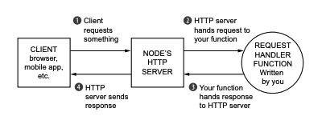
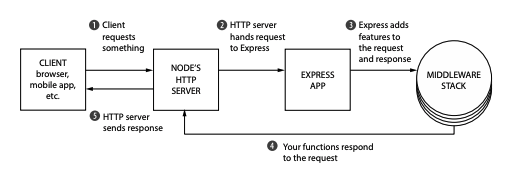

# Lecture 9

### Node.js

- V8
- libuv

###### EventLoop & tasks queue

```js
const fs = require('fs');

fs.open(__filename, 'r', (err, fd) => {
  console.log('io operation');
});

setImmediate(() => {
  console.log('setImmediate');
});

process.nextTick(() => {
  console.log('nextTick');
});

new Promise(resolve => {
  resolve('promise');
}).then(console.log);

console.log('start');
```

###### HTTP & HTTPS

```js
const http = require('http');

const server = http.createServer((req, res) => {
  res.writeHead(200);
  res.write('Hello world!');
  res.end();
});

server.listen(3000);

```

```bash
openssl req -nodes -new -x509 -keyout server.key -out server.cert
```

```js
const https = require('https');
const fs = require('fs');

const options = {
  key: fs.readFileSync('./certs/server.key'),
  cert: fs.readFileSync('./certs/server.cert')
};

const server = https.createServer(options, (req, res) => {
  res.writeHead(200);
  res.write('Hello world!');
  res.end();
});

server.listen(3000);
```

###### Headers & HTTP status codes

### Node.js Frameworks

- Express
- Koa
- Nest
- Hapi
- Adonis
- Sails
- ...

###### Koa

```js
const Koa = require('koa');
const app = new Koa();

app.use(async ctx => {
  ctx.body = 'Hello world!';
});

app.listen(3000);
```

###### Middlewares

**Middleware** - request and response handler function.



---



```js
function(request, response, next) {
  // ...
}
```
